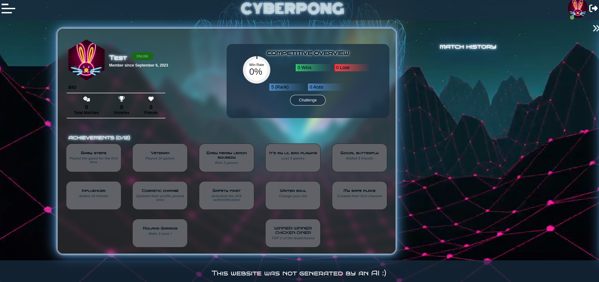

# FT_Transcendence

## Table of contents 📖

- [About 🧬](#about---)
  * [Tech stack ⌨](#tech-stack--)
- [Mandatory requirements 📍](#mandatory-requirements---)
  * [1. A Single Page Application (S.P.A.) …](#1-a-single-page-application--spa---)
  * [… who is secure 🔐](#--who-is-secure---)
  * [2. An Elaborate User Account  💫](#2-an-elaborate-user-account----)
  * [3. A Complete Chat 🗨️😼](#3-a-complete-chat------)
  * [4. A Triple-A Game 🎮](#4-a-triple-a-game---)
- [Demo 🔬](#demo---)
- [Authors 🪧](#authors---)
- [Some great resources to get you started 📝](#some-great-resources-to-get-you-started---)

<small><i><a href='http://ecotrust-canada.github.io/markdown-toc/'>Table of contents generated with markdown-toc</a></i></small>

## About 🧬

FT_Transcendence is the last project of [42's common core](https://42.fr/le-programme/apprentissage-innovant/). This project is about building a website which hosts a Pong competition. Thanks to this website, users will be able to play Pong with each other. They will have a user interface, a chat and in-realtime online multiplayer games.

### Tech stack ⌨

- Backend : **NestJS**
- Database : **PostgreSQL**
- ORM : **Prisma**
- Frontend : **Typescript ReactJS**
- Libraries worth to mention:
    - *Data-fetching, API* | [React-query](https://tanstack.com/query/latest/) : asynchronous state management library (handles caching, background updates and stale data ),
    - *Data-fetching, API* |  [Axios](https://axios-http.com/docs/intro): a promise-based HTTP Client
    - *Friends search bar* | [Meilisearch](https://www.meilisearch.com/) : open-source, lightning-fast, and hyper-relevant search engine
    - *Frontend part of our game* | [PixiJS](https://pixijs.com/) : 2D WebGL renderer
    - *Websockets for game + chat* | [Socket.io](https://socket.io/) : library that enables low-latency, bidirectional and event-based communication (websockets) between a client and a server.

## Mandatory requirements 📍

### 1. A Single Page Application (S.P.A.) …

- [x]  Code a dynamic website with a single web page
- [x]  design must be responsive
- [x]  the user must be able to use the `back` et `forward` buttons of the browser
- [x]  must be compatible with Chrome and another web browser of your choice
- [x]  no errors or warnings in the console
    
    ### … who is secure 🔐
    
- [x]  all the passwords given by a user must be hashed
- [x]  the website must be protected against SQL injections
- [x]  ⚠️ all credentials, API keys and other sensible info must not be online, on github or else!

### 2. An Elaborate User Account  💫

- [x]  Login must be done through the 42 API (OAuth system)
- [x]  2FA (Two-Factor Authentication) must be possible
- [x]  Each username must be unique
- [x]  You should be able to choose an avatar and have a default one
- [x]  Possibility to add other friends
- [x]  Ability to see the status of your friends (online, offline, in a game...)
- [x]   Collection and display of stats
    - [x]  Wins and losses
    - [x]  Elo level
    - [x]  Achievements and milestones
- [x]  Catalog the Match History of a user, viewable by anyone

### 3. A Complete Chat 🗨️😼

- [x]  A user must be able to send a direct private message to another user
- [x]  A user must be able to block another user
- [x]  Presence of channels
    - [x]  Which can be public or private
    - [x]  Or protected by a password
- [x]  A user who creates a channel automatically becomes the owner
- [x]  The owner of a channel:
    - [x] Is also a channel admin and can grant this privilege to other regular users
        - [x]  A channel admin can kick, ban, or temporarily mute all users except the owner.
    - [x]  Can add, modify, or delete a password to access the channel
- [x]  A user must be able to invite another to a game of Pong via the chat
- [x]  A user must be able to access the profiles of other users via the chat

### 4. A Triple-A Game 🎮

- [x]  The game must be a **Pong**
- [x]  Real-time play against another player must be possible
- [x]  There must be a match-making system with a queue
- [x]  Visually, we have free cards
- [x]  Additional features can be added to the game, but a vanilla mode must be present!
- [x]  The game must also be responsive

## Demo 🔬

## Authors 🪧

This was a group project made with 🤍 by four people:
- Fahima [@fahima8897](https://www.github.com/fahima8897)
- Anna [@ajealcat](https://www.github.com/ajealcat)
- Simon [@smaugdela](https://www.github.com/smaugdela)
- Marine [@marineks](https://www.github.com/marineks)

## Some great resources to get you started 📝

